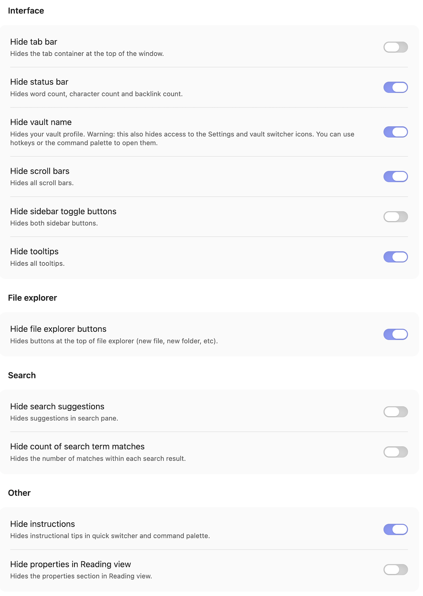

_This plugin didn't work well and is no longer beinging maintained._

# View Actions Mover

An Obsidian plugin that provides moves the view actions (e.g., the "current view" and "more options" ellipsis placed in the upper right of document editor) to the tab header. More specifically, the plugin moves `div.view-actions` under the `div.workspace-tab-header-container`. I developed with plugin to work with `hide-things.css` snippet, which can be found [here](https://github.com/matthewkeating/obsidian-css-snippets).

## Installation

This plugin is not listed in the Obsidian Community Plugins directory and must be installed manually.

### Prerequisites

- Obsidian 1.0.0 or later
- Community plugins enabled (Settings → Community plugins → Turn on community plugins)

### Steps

1. Download `main.js`, `manifest.json`, and `styles.css` from this repository.
2. Create the folder `<your-vault>/.obsidian/plugins/obsidian-view-actions-mover/` if it does not exist.
3. Copy the three downloaded files into that folder.
4. In Obsidian, open **Settings → Community plugins**, find **View Actions Mover**, and toggle it on.

## Building from Source

If you want to modify the code and rebuild, use:

```bash
npm run build
```

Runs TypeScript type checking, then bundles to `main.js`.

## Development (watch mode)

Best method for development:

```bash
npm run dev
```

This watches for changes and rebuilds `main.js` automatically. You can symlink the plugin folder into your vault to avoid copying files manually:

```bash
ln -s /path/to/obsidian-minimal-UI-elements \
      /path/to/your-vault/.obsidian/plugins/obsidian-view-actions-mover
```

Then use the [Hot Reload](https://github.com/pjeby/hot-reload) community plugin to pick up changes without restarting Obsidian.

## Usage Notes

### Themes

This plugin should work with most themes. For my setup, I use the default Obsidian theme.

### CSS Snippets

I use additional CSS snippets, which, if you are interested, you can find [here](https://github.com/matthewkeating/obsidian-css-snippets).

### Complementary Plugins

This plugin works on it's own but, when paired with [Hider](https://github.com/kepano/obsidian-hider), can provide an even more streamlined interface. For those who might be interested in this option, here is a screen capture of my Hider configuration.


